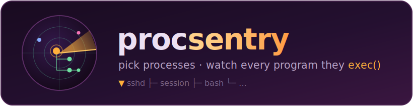
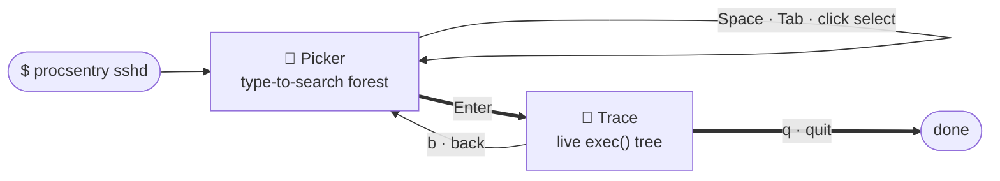
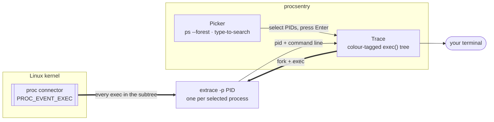

<div align="center">



[](https://github.com/binRick/procsentry/releases/latest)
[](https://github.com/binRick/procsentry/releases)


[](LICENSE)

<!-- repostats:start -->
[](https://repostats.app/r/binRick/procsentry)
[](https://repostats.app/r/binRick/procsentry)
[](https://repostats.app/r/binRick/procsentry)
[](https://repostats.app/r/binRick/procsentry)
[](https://repostats.app/r/binRick/procsentry)
<!-- repostats:end -->

### Pick processes, then watch a live tree of everything they run.

</div>

procsentry is an interactive terminal tool that pairs a fuzzy process picker
with a live `exec()` tracer. Search for a process by name, select one or more,
and watch — in a colour-coded tree — every program their subtrees launch, as it
happens. It's a friendly TUI front-end for
[`extrace`](https://github.com/chneukirchen/extrace), built on
[termpaint](https://github.com/termpaint/termpaint).


> The trace pane is **Linux-only and needs root** (it uses the kernel process
> connector). The process picker works anywhere `ps` does.



---

## Why

When you want to know *what a process actually runs* — the shell-outs a daemon
makes, the toolchain a build kicks off, the commands landing in an SSH session,
the helper a cron job spawns — the usual answer is `strace -f`, which is heavy,
noisy, and changes timing. procsentry instead taps the Linux **proc connector**
(via `extrace`), which the kernel uses to broadcast every `fork`/`exec`. That
means:

- **Near-zero overhead** — you're reading a kernel event stream, not ptracing.
- **Whole subtrees** — select a parent and you see everything its descendants
  exec, no matter how deep.
- **Live and readable** — each traced process is a labelled root with its
  children nested beneath it, colour-tagged so several traces read clearly at
  once.

## Features

- 🔎 **Type-to-search picker** — just start typing; the `ps --forest` tree
  filters live. The search is **subtree-aware**: searching `sshd` shows sshd
  *and* every process running under it (the shells, scripts, and commands in
  each session) even though those children don't contain "sshd".
- 🌳 **Tree everywhere** — the picker is a process forest (`\_` style); the
  trace shows each selected parent (`▼`) with its exec'd children nested under
  `├`, depth taken from the real process hierarchy.
- 🎯 **Multi-select** — trace several unrelated processes at once, each in its
  own colour. `Tab` selects the highlighted process and all its children in one
  stroke.
- 🖱️ **Mouse + fast keys** — wheel-scroll and click-to-select; the ↑/↓ keys
  accelerate when held so a 250-process list flies by, while a single tap stays
  precise.
- 🚀 **Launch into a search** — `procsentry sshd` opens pre-filtered.
- 🎨 **Two render modes** — crisp text cells everywhere, plus an animated kitty
  graphics backdrop on terminals that support it (kitty, iTerm2, WezTerm, …).
- 📦 **Self-contained** — termpaint is vendored; `make` needs nothing but a C
  compiler.

## Demo

### Kitty graphics — `procsentry-gfx`

The picker and the live exec tree float over an animated backdrop.


### ASCII cells — `procsentry`

The same workflow as plain text, for any terminal (and the fallback the gfx
build uses where graphics aren't available).


---

## Install

### RHEL / Rocky / Alma 9 (RPM)

Grab the RPM from the [latest release](../../releases/latest):

```sh
sudo dnf install ./procsentry-*.el9.x86_64.rpm
# then, as root:
sudo procsentry-gfx
```

### Prebuilt Linux binary

An `x86_64` build (compiled on EL9, so it runs on RHEL/Rocky/Alma 9 and newer)
is attached to each release:

```sh
curl -LO https://github.com/binRick/procsentry/releases/latest/download/procsentry-linux-x86_64.tar.gz
tar xzf procsentry-linux-x86_64.tar.gz
sudo ./procsentry-gfx
```

You'll also need `extrace` on the host for the trace pane —
see [extrace](https://github.com/chneukirchen/extrace) (often `dnf install
extrace` / `apt install extrace`, or build it; point procsentry at it with
`PROCSENTRY_BIN=/path/to/extrace` if it's not on `PATH`).

### Build from source

termpaint is vendored, so there's nothing to download:

```sh
git clone https://github.com/binRick/procsentry.git
cd procsentry
make
sudo ./build/procsentry-gfx
```

Requirements: a C compiler and `make`. The picker builds and runs on macOS too
(handy for trying the UI), but the trace needs Linux + root.

---

## Usage

```sh
sudo procsentry-gfx              # start; the picker opens
sudo procsentry-gfx sshd         # start pre-filtered to sshd and its subtree
sudo procsentry-gfx -c excludes.conf sshd   # hide exec'd commands matching the config's regexes
PROCSENTRY_CELLS=1 sudo procsentry-gfx   # force plain-text rendering
```

**In the picker** — just start typing to search; the list narrows to matches
*and their subtrees*. Then:

| Key | Action |
|---|---|
| *type* | search (live, subtree-aware) |
| `Backspace` | edit the search |
| `↑` / `↓` | move the highlight (hold to accelerate) |
| mouse wheel | scroll the list |
| `Space` / click | select / deselect the highlighted process |
| `Tab` | select the highlighted process **and all its children** (its subtree) |
| `PgUp` / `PgDn`, `Home` / `End` | page / jump |
| `Enter` | start tracing the selected processes |
| `Esc` | clear the search, or quit if it's empty (`Ctrl-C` also quits) |

**In the trace** — the selected processes appear as roots (`▼`) with their
exec'd children nested beneath:

| Key | Action |
|---|---|
| `↑` / `↓`, wheel | scroll the log |
| `PgUp` / `PgDn` | page |
| `f` | follow (jump to and stick to the newest events) |
| `b` | back to the picker |
| `q` | quit |

---

## Excluding commands

Busy hosts run a lot of housekeeping — health-check shell-outs, log rotators,
metric collectors — that drowns out the execs you actually care about. Point
procsentry at a **config file** of regexes and any matching exec'd command is
dropped from the trace (the titlebar shows a running `N filtered` count):

```sh
sudo procsentry -c excludes.conf sshd                 # flag
PROCSENTRY_CONFIG=excludes.conf sudo procsentry sshd  # or env var
```

The file is **one [POSIX extended](https://man7.org/linux/man-pages/man7/regex.7.html)
regex per line**; blank lines and lines starting with `#` are ignored, and
surrounding whitespace is trimmed. Each pattern is matched (case-sensitively,
unanchored) against the **command line of every exec'd process** — the text
`extrace` prints after the PID — so a match anywhere in the line excludes it.
A bad regex is reported (with its line number) and skipped; an unreadable
config path is a hard error.

```sh
# excludes.conf — hide routine noise from the trace

# a specific housekeeping shell-out, e.g. bash -c 'ls /proc/*/fd'
# (extrace prints the argv, so the '*' is literal — escape it or use .*)
bash -c .*ls /proc/.*/fd

# common low-signal commands — the trailing ( |$) keeps `ls` from also
# matching `lsof`, etc. (portable POSIX ERE; avoid GNU-only \b here)
^/usr/bin/(ls|cat|stat|sleep)( |$)
^/bin/sleep [0-9]

# anything launched from a monitoring agent's directory
^/opt/(datadog|telegraf|node_exporter)/

# a single program by name, wherever it lives
(^|/)logrotate( |$)
```

> The match target is the exec'd command line *without* the leading PID, so
> don't anchor patterns to a number. Use `^` to anchor to the start of the
> program path (e.g. `^/usr/bin/ls`), or leave a pattern unanchored to match a
> substring anywhere (e.g. `sleep`).

---

## Use cases & examples

**See what a daemon shells out to.** Postfix, cron, a CI runner, a container
runtime — anything that spawns helpers:

```sh
sudo procsentry crond      # watch every job cron fires and what each runs
sudo procsentry dockerd    # see runc/containerd-shim and the container entrypoints
```

**Watch an SSH session live.** Select `sshd` and you get every command that
lands in every active session, grouped per connection:

```sh
sudo procsentry sshd
```

**Audit a build.** Point it at `make`/`ninja`/your CI shell and watch the
compiler, linker, and codegen invocations stream by as a tree — great for
understanding an unfamiliar build or spotting surprise downloads:

```sh
sudo procsentry-gfx make
```

**Catch short-lived and one-shot execs.** Because it reads kernel events, it
sees processes that come and go faster than `ps`/`top` can refresh — the `git`
hooks, the `sh -c '…'` wrappers, the helper a script forks for a millisecond.

**Light-touch incident triage.** Tracing a suspicious parent (a webserver, an
interpreter) shows what it's launching without the overhead or footprint of
attaching a debugger.

---

## How it works



Step by step:

- The **picker** is `ps --forest` rendered as a tree. Each process records its
  tree depth, so a search match can pull in its whole subtree (in `ps`'s
  depth-first order, a node's descendants are exactly the run of following
  lines indented deeper than it).
- The **trace** spawns one `extrace -p PID` per selected process. `extrace`
  subscribes to the kernel's `PROC_EVENT_EXEC` connector messages and reports
  each new program executed within that PID's subtree. procsentry captures that
  output, re-renders it as a per-parent tree, and colour-tags each root.
- Rendering is [termpaint](https://github.com/termpaint/termpaint) cells; the
  `-gfx` build adds an RGBA backdrop via the
  [kitty graphics protocol](https://sw.kovidgoyal.net/kitty/graphics-protocol/),
  punched transparent wherever a panel is drawn so the UI floats over it.

## Requirements

- **Trace pane:** Linux, **root** (or `CAP_NET_ADMIN`), and `extrace` on the
  host. extrace needs a kernel with the proc connector (`CONFIG_PROC_EVENTS`),
  which is standard on mainstream distros.
- **Picker:** anything with `ps`. Builds on macOS too (cells only there;
  `ps --forest` isn't available, so the picker is a flat CPU-sorted list).

## Configuration

| Env var | Default | Effect |
|---|---|---|
| `PROCSENTRY_FILTER` | unset | initial picker search (same as `procsentry <term>`) |
| `PROCSENTRY_CONFIG` | unset | path to a config of exclude regexes (same as `-c FILE`) — see [Excluding commands](#excluding-commands) |
| `PROCSENTRY_BIN` | `extrace` on `PATH` | path to the `extrace` binary |
| `PROCSENTRY_CELLS` | unset | force plain-text rendering (skip kitty detection) |
| `PROCSENTRY_MAXDIM` | `640` | kitty backdrop framebuffer size cap |
| `PROCSENTRY_FPS` | demo-specific | target frame rate for the gfx backdrop |

## License

procsentry is [0BSD](LICENSE). It bundles
[termpaint](https://github.com/termpaint/termpaint) (Boost Software License
1.0, see `termpaint/COPYING`) and is a front-end for
[`extrace`](https://github.com/chneukirchen/extrace) (MIT).
